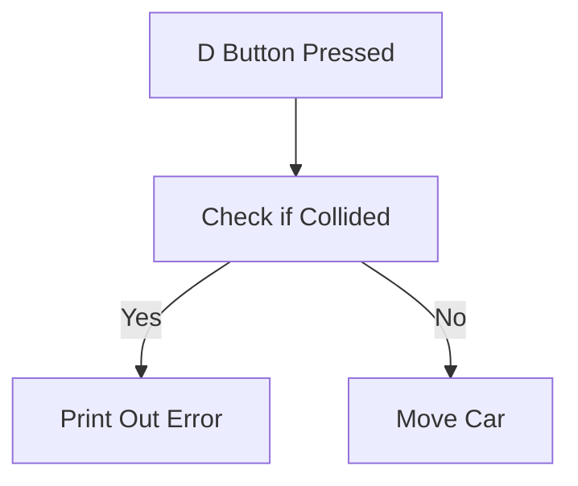

Activity 5.1 - Collision Detection
*Planning Ahead*

variables car_x - track car x pixel coordinate
vairbles car_y - track car y pixel coordinate

variable tree_x - static tree x pixel coordinate
variable tree_y - static tree y pixel cooridnate

bool collision - default to false

when user presses 'd' pressed
    if car_x + unit of x movement would be greater than or equal to tree_x
    or if the car_y + unit of y movement would be less than or equal to tree_y
        set collision to true

    if not collision
        update move car left and update (x, y) coordinates of car
    otherwise
        print out statement to say a collision happened

